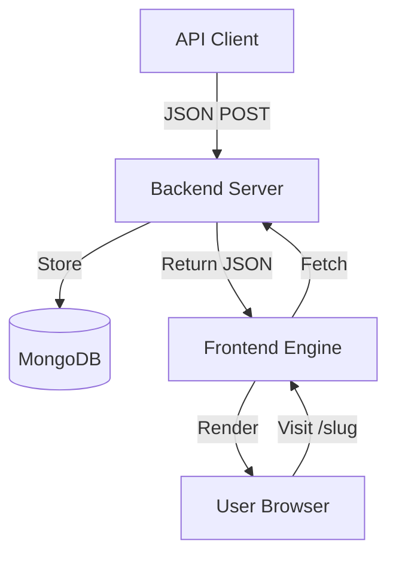

# 🚀 Bino: The Professional Dynamic Page Engine

<div align="center">

[](https://nextjs.org)
[](https://expressjs.com)
[](https://mongodb.com)
[](https://tailwindcss.com)

**Bino** is the ultimate bridge between your raw data and premium user experiences. 
Turn JSON schemas into high-performance, SEO-optimized landing pages instantly via API.

[Explore Docs](/api) • [Report Bug](https://github.com/digeesh038/bino-app/issues) • [Request Feature](https://github.com/digeesh038/bino-app/issues)

</div>

---

## 💎 What makes Bino different?

Bino isn't just a page builder; it's a **Dynamic Page Engine**. It allows marketing teams to launch professional campaigns in seconds without touching a single line of code, while developers maintain total control over the design system.

### ✨ Premium Features

- ⚡ **Next.js 15 Power**: Blazing fast server-side rendering with Turbopack support.
- 🎨 **Aesthetic Excellence**: Pre-built components with glassmorphism, mesh gradients, and smooth Framer Motion animations.
- 🌐 **Instant Deployment**: POST a JSON schema → get a live URL at `/{slug}` instantly.
- 🔍 **SEO Ready**: Automatically generated meta tags, sitemaps, and robots.txt for every page.
- 📱 **Fully Responsive**: Every block is meticulously crafted to look stunning on mobile, tablet, and desktop.

---

## 🏗️ Project Architecture

Bino is built as a scalable monorepo, splitting concerns for maximum performance:



| Folder | Tech | Description |
| :--- | :--- | :--- |
| **`/frontend`** | Next.js 15 | The visual engine. High-performance rendering and component library. |
| **`/backend`** | Express & Mongoose | The core logic. Manages page storage, validation, and retrieval. |

---

## 🛠️ Getting Started

### 1. Installation
Install dependencies for both projects independently:
```bash
# Frontend
cd frontend && npm install

# Backend
cd ../backend && npm install
```

### 2. Run Locally
Start the development servers:
```bash
# Terminal 1
cd backend && npm run dev

# Terminal 2
cd frontend && npm run dev
```

Visit **[localhost:3000](http://localhost:3000)** to see Bino in action.

---

## 🧩 Premium Components

Bino comes with a library of high-end, programmable components:

> [!TIP]
> You can customize these components via the JSON API. Check the [API Docs](/api) for a full list of props.

- **`TextSection`**: Super-bold headings with mesh gradients and readable body text.
- **`ImageBlock`**: Interactive images with hover-zoom and decorative overlays.
- **`Card`**: Dynamic grids with glassmorphism and interactive float effects.
- **`StatsBox`**: Professional metric counters with customizable icons.
- **`CTA`**: High-conversion call-to-action sections with premium backgrounds.

---

## 🚀 Creating your first page

Send a simple POST request to `http://localhost:3000/api/pages`:

```json
{
  "slug": "pro-campaign",
  "components": [
    {
      "type": "TextSection",
      "props": {
        "title": "Build the Future",
        "alignment": "center",
        "gradient": "from-blue-600 to-indigo-600"
      }
    },
    {
      "type": "CTA",
      "props": {
        "heading": "Ready to launch?",
        "ctaText": "Get Started",
        "href": "/api"
      }
    }
  ],
  "metadata": {
    "title": "Pro Campaign | Bino",
    "description": "Your SEO optimized campaign page."
  }
}
```

Your page will be live at `http://localhost:3000/pro-campaign` **instantly**.

---

